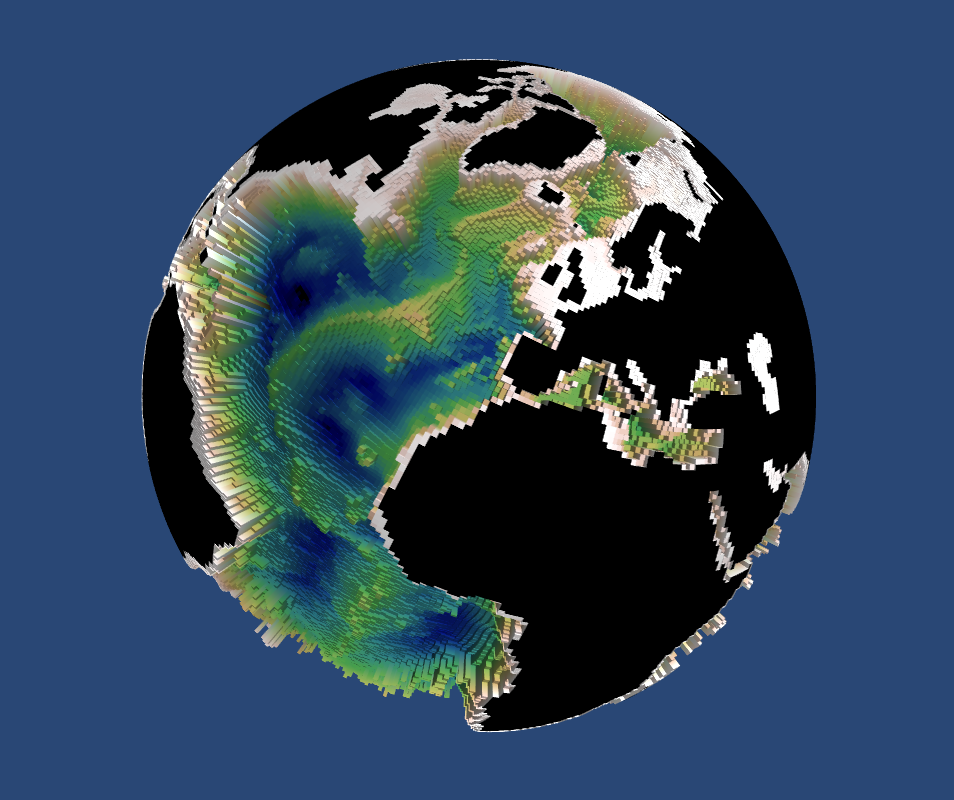

Introduction
------------

Plots 3-D fields and trajectories from the NEMO ocean model, using the python mayavi VTK interface library. Python 2 only.

Simple Usage
============

Setup work directory and copy files into it:

.. highlight:: bash

::
   
 mkdir ORCA1
 cd ORCA1

 wget -r -nH --cut-dirs=3 --no-parent --reject="index.html*" \
   http://gws-access.ceda.ac.uk/public/nemo/nemosphere/ORCA1_test_files/

Just output topography ::
 
 3ddriver -g -d ORCA1_test_files/domain

Rotate sphere by dragging mouse; zoom with scroll wheel;
move by dragging with scrollwheel/middle button depressed

Add surface of ideal age=100 yrs; use greyscale for topography ::
  
 3ddriver -g -d ORCA1_test_files/domain --cmap gist_gray \
	       -s ORCA1_test_files/2010/ORCA1-N406_2010y01P.nc \
	       --field AWT --levels 0.2 0.21 --opacity 1.

3ddriver.py -g --ilo 2400 --ihi 3500 --jhi 700 -d ../0083  --cmap gist_gray  -s ../0083/ORCA0083-N01_20100709d05T.nc --field votemper --levels 0. 0.01 --opacity 1.0  --size 1920 108

3ddriver.py --ilo 2550 --ihi 3500 --jlo 1650 --jhi 2700 -d ../0083  --cmap gist_gray --dots MIDAS/1_12/10yr_all_Moreto/ariane_trajectories_qualitative.nc --times 120 -o 120.png --no_display --stride 30 --camera camera_MIDAS_1_12.json

3ddriver.py --ilo 2550 --ihi 3500 --jlo 1650 --jhi 2700 -d ../0083  --cmap gist_gray --dots MIDAS/1_12/10yr_all_Moreto/ariane_trajectories_qualitative.nc --times 24 -o 024.png --no_display --stride 30 --camera something
